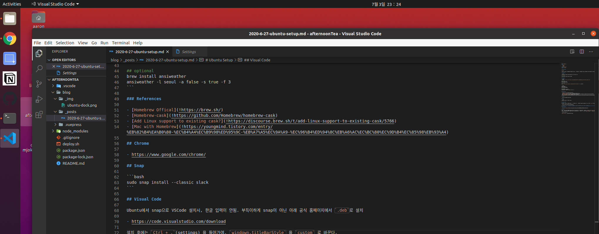
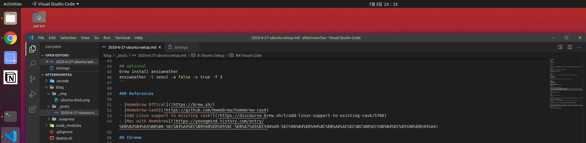
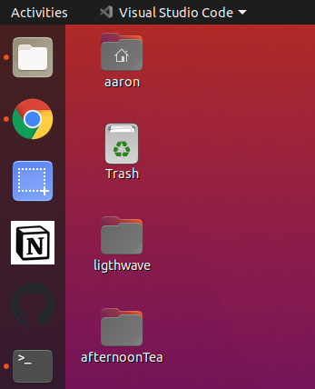

# Ubuntu Setup

[[toc]]

이상하게 ubuntu를 사용하다보면 새 컴퓨터처럼 깨끗한 상태에서 사용하고 싶어진다. 그럴때마다 편하게 다시 설치하려고 기록해둔다.

## Essential

```bash
sudo apt-get install build-essential curl file git vim

## optional
sudo apt-get install htop tree wget
```

## Homebrew

```bash
/bin/bash -c "$(curl -fsSL https://raw.githubusercontent.com/Homebrew/install/master/install.sh)"

## For test
brew install hello
brew uninstall hello

## set PATH
echo 'eval $(/home/linuxbrew/.linuxbrew/bin/brew shellenv)' >> ~/.profile
```

```bash
brew install
brew install zsh
brew install python3

## optional
brew install ansiweather
ansiweather -l seoul -a false -s true -f 3
```

### References

- [Homebrew Offical](!https://brew.sh/)
- [Homebrew-cask](!https://github.com/Homebrew/homebrew-cask)
- [Add Linux support to existing cask?](!https://discourse.brew.sh/t/add-linux-support-to-existing-cask/5766)
- [Mac with Homebrew](!https://youngmind.tistory.com/entry/%EB%82%B4%EA%B0%80-%EC%84%A4%EC%B9%98%ED%95%9C-%EB%A7%A5%EC%9A%A9-%EC%96%B4%ED%94%8C%EB%A6%AC%EC%BC%80%EC%9D%B4%EC%85%98%EB%93%A4)

## Chrome

- https://www.google.com/chrome/

## Snap

```bash
sudo snap install --classic slack
```

## Visual Code

Ubuntu에서 snap으로 VSCode 설치시, 한글 입력이 안됨. 부득이하게 snap이 아닌 아래 공식 홈페이지에서 `.deb`로 설치

- https://code.visualstudio.com/download

설치 후에는 `Ctrl + ,`(settings) 을 들어가여, `windown.titleBarStyle` 을 `custom` 로 바꾼다.




### References

- [VS Code on Ubuntu](!https://gist.github.com/philoskim/a79440bd51ae40f04a4d7cafa472caf1)
- [VS Code titleBar](!https://www.reddit.com/r/vscode/comments/9624id/how_did_i_not_know_about_this_setting_its/)

## Notion

노션은 Linux용 App이 없기에 Chrome shortcut 생성. 아래 링크로 노션 웹페이지 접속후, `settings > More tools > Create Shortcut` 클릭후, Open as window 옵션을 체크하여 생성. 새로 띄어진 Chrome 창이 있는 상태에서, Dock에서 Add to Favorite을 하여 저장한다. 같은 방식으로 다른 사이트들도 저장 가능하다.

- https://notion.so


