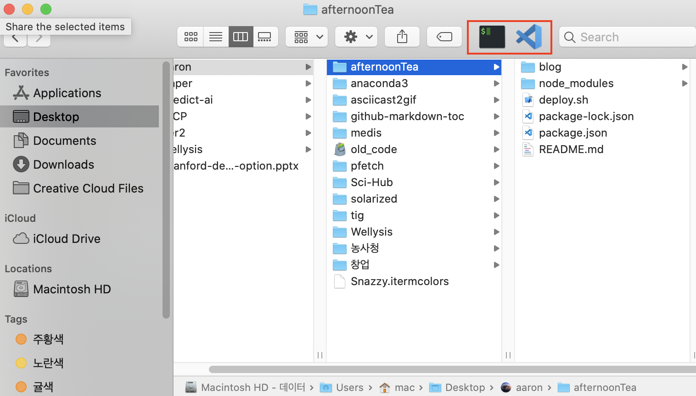

# Mac Setup

Mac은 우분투와는 다르게 처음부터 다시 셋팅한 경험은 거의 없다. 또한 개인적인 생각으로 Mac은 초기 셋팅을 많이 하지 않아도 불편하지 않게 쓸수 있다고 생각한다. 그래서 꼭 필요한 것 보다는 작은 팁들과 프로그램들로 정리하고자 한다.

## 1. Finder



사용하는 프로그램의 아이콘을 `⌘` 을 누른 상태에서, finder 좌상단으로 가져가면 프로그램 아이콘이 고정된다. 고정된 아이콘에 폴더를 가져가면 해당 경로로 프로그램을 바로 실행할 수 있다. 터미널에 가면 해당 경로에서 터미널이 열리고, VSCode로 가져가면 해당 폴더를 VSCode에서 실행한다.

## 2. Terminal

Finder와 유사하게 터미널에서 보고 있는 경로를 바로 열고 싶을때가 많다. 이럴때를 대비해서 아래처럼 alias를 만들어 놓는다.

```bash
## GitKraken
alias kraken="open -na 'GitKraken' --args -p $(pwd)"
```

다행이도 VSCode와 finder는 설정없이다 된다.

```bash
## Finder
open .

## VSCode
code .
```

## 3. Shortcut

단축키를 만들때 별도 프로그램을 설치하기 싫어서 AppleScript를 사용한다. 아래는 가끔씩 우분투처럼 터미널을 열고 싶을때 사용하는 방식이다.

```bash
# Automator
on run {input, parameters}
	tell application "iTerm"
		if it is running then
		end if
		activate
	end tell
end run
```

아래아 같은 스크립트를 저장한 뒤에, `System Preferences > Keyboard > Shortcut > Service`에서 단축키로 `⌘ + ^ + T`로 설정했다. 물론 `⌘ + space`를 하여 iterm을 검색해서 켜도 되지만, 그냥 ubuntu를 사용하던 습관 그대로 하고 싶을때가 있다.

## 사용중인 앱

### Spectacle

Window나 Ubuntu처럼 창을 정리할 떄 정말 좋은 앱.

- <https://www.spectacleapp.com/>

### Allkdic

영어 단어 사전을 작은 화면에서 빠르게 검색해볼 수 있는 간편 앱. `⇧ + ⌘ + space`로 단축키를 설정하여 사용중.

- <http://allkdic.xoul.kr/>
