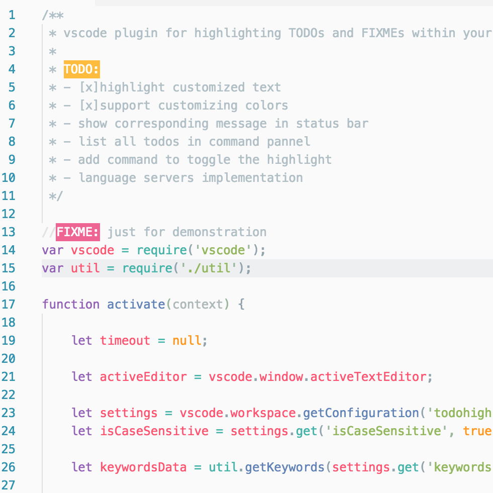
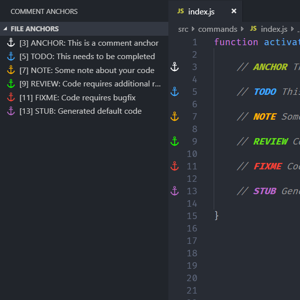

# VSCode Extension

- [VSCode Extension](#vscode-extension)
  - [기본 셋팅](#기본-셋팅)
  - [MS provided](#ms-provided)
  - [Theme](#theme)
  - [Git](#git)
  - [Language](#language)
    - [Markdown](#markdown)
    - [HTML](#html)
    - [TypeScript](#typescript)
    - [Python](#python)
  - [Service](#service)

크롬까지 다 설정했으면 이제 VSCode와 Terminal가 남았다. VSCode는 크롬만큼 동기화가 자동으로 되지는 않지만, 약간의 설정으로 가능하게 할 수 있다. 아래 Extensions

## 기본 셋팅

**주석 강조: TODO Highlight / Comment Anchors**

<div style="display: flex">
  <div style="flex: 1;">
    
    <p style="text-align: center">TODO Highlight Github 이미지</p>
  </div>
  <div style="flex: 1;">
    
    <p style="text-align: center">Comment Anchors Github 이미지</p>
  </div>
</div>

이전에는 TODO Highlight를 많이 사용했지만, 최근에는 Comment Anchors도 좋다고 느낀다. TODO는 Highlight가 되서 눈에 확 띄어서 좋지만, 전체 프로젝트에 어떤 곳이 있는지 확인하려면 검색으로 하거나, `List highlighted annotations`를 해야 한다. 이와 반면에 Comment Anchors는 사용하면 좌측 sidebar에서 전 프로젝트에 추가한 내용들이 보인다.

두 프로젝트 다 코드가 Github에 있으니, 시간이 될때 TODO Hightlight의 스타일과 Comment Anchors의 sidebar view를 합쳐보면 좋을 것 같다.

**Bracket 가시성: Bracket Pair Colorizer / Rainbow Brackets**


<p>Bracket Pair Colorizer Github 이미지</p>

괄호를 쉽게 구분할 수 있게 도와주는 Extension. 원래는 Rainbow Brackets을 사용했는데, Bracket Pair Colorizer가 ver.2도 나오고, 계속 유지보수 하고 있는 것 같아서 바꾸었다. 그러나 두개 다 좋기에, 어느 것을 선택해도 큰 상관 없다.

**Path Intellisense**


<p>Path Intellisense Github 이미지</p>

경로를 지정할때 자동으로 선택지를 보여줍니다. 상대경로와 절대경로 모두 다 작동하며, 파일 형식에 크게 가리지 않고 잘 추천을 해줍니다.

**Setting Sync**

한 컴퓨터의 VSCode에 설치한 Extension을 다른 컴퓨터에서도 사용 가능하게 해주는 Extension이다. 또한 이 데이터는 Gist에 저장되므로 다른 사람에게 공유도 가능하다. 물론 프로젝트에서는 `.vscode/extensions.json`을 활용하면 이 기능을 대체할 수 있다.

```json
{
  "recommendations": [
    "eamodio.gitlens",
    "esbenp.prettier-vscode",
    "2gua.rainbow-brackets",
    "msjsdiag.vscode-react-native",
    "wayou.vscode-todo-highlight",
    "visualstudioexptteam.vscodeintellicode"
  ]
}
```

## MS provided

- Live Share
- Docker
- koean language pack for visual studio code

## Theme

- vscode-icon
- Material Theme / Material Icon Theme
- Monokai or Monokai Pro

## Git

- Git History (의외로 잘 안쓰게 됨, GitKraken이 더 이뻐서,,,)
- Git Lens (기본으로 나오는 것도 좋지만 뒤로 갈때가 대박) 기능이 많아 배워야 한다

## Language

### Markdown

- markdown to pdf
- Markdown All in One

### HTML

- Auto Close Tag
- Auto Rename Tag
- Snapshot-tools
- Color Highlight / vscode-styled-components
- Live Server
- Emmet (ul>li>)
- Debugger for Chrome
- **Prettier**: 매우 대중적인 Formatter.

### TypeScript

- TypeScript Extension Pack or Tslint
- jest

### Python

- Notebook Support (.ipynb)
- autoDocstring
- AREPL (바로 옆에서 결과 확인)
- indent-rainbow 스페이스 간격 확인

## Service

- WakaTime
- Dash (오프라인 문서, 나는 잘 안씀)
